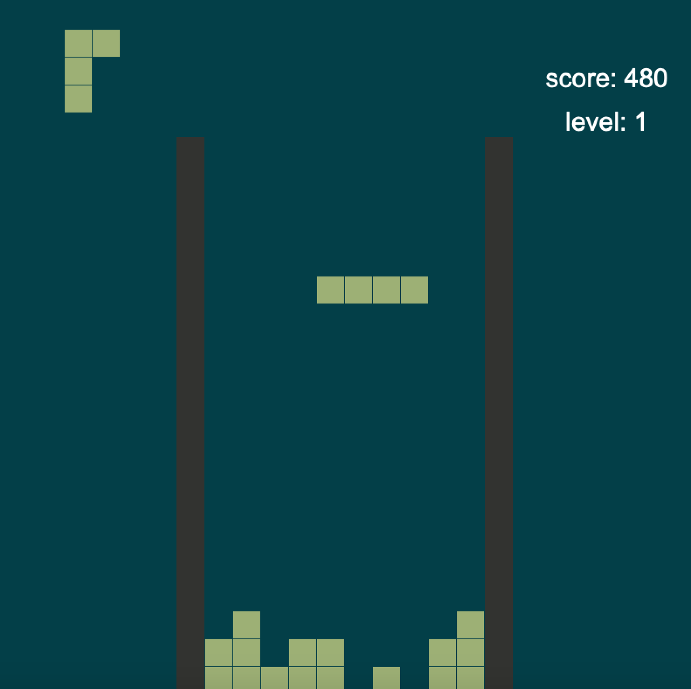

# Tetris++

A tetris game written in C++

##Installation

You will need to install [Cinder](https://libcinder.org/download).

You will also need to install the external library [PretzelGui](https://github.com/cwhitney/PretzelGui).

##How To Play

Press Enter/Return on the starting screen and and play with the following controls

| Key      | Action                                             |
|----------|----------------------------------------------------|
| `↑` , `k` , `w` | Rotate falling piece                        |
| `→` , `l` , `d` | Move piece to the right					    |
| `←` , `h` , `a` | Move piece to the left                      |
| `↓` , `s` , `j` | Move piece down                             |
| `p`             | pause                                       |

Filling a row/line will clear it. The scoring system for the game follows the original BPS scoring system.

| Line Clear | Points                   |
|------------|--------------------------|
| 1 (single) | 40                       |
| 2 (double) | 100					    |
| 3 (triple) | 300                      |
| 4 (tetris) | 1200                     |

## Credits

[Tetris tutorial in C++ platform](http://javilop.com/gamedev/tetris-tutorial-in-c-platform-independent-focused-in-game-logic-for-beginners/)

**Author**: Luciana Toledo-López - [`lucianat@illinois.edu`](mailto:example@illinois.edu)
